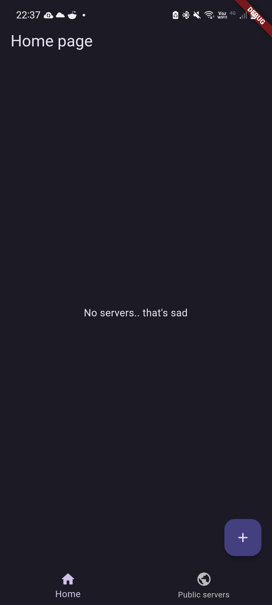
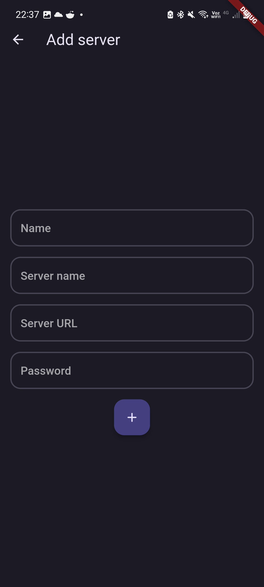
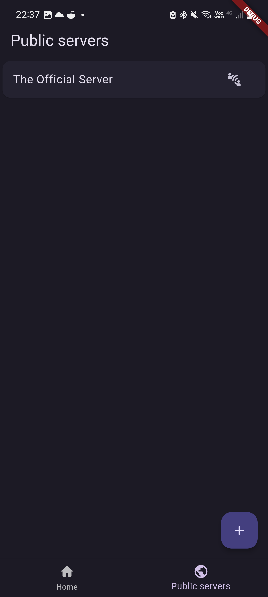

# Connect App: The MessaCer App

A MessaCer client using Flutter, Dart and Material Design 3 (Material You).

## Getting Started

You can install this app on your Android device by downloading the APK file from the [releases page](https://github.com/PerformanC/Connect/releases).

## Supported platforms

- Android (5.0+) (recommended)
- Linux (working)
- iOS (not tested, no icon)
- macOS (not tested, no icon)
- Windows (not tested, no icon)

## Screenshots

## Logging

This project does not log any of your activities, besides the server logs. The server logs are only accessible by the server administrator.

The app itself doesn't contain (and will never contain) any analytics or tracking code.

## Contributing

If you want to contribute to this project, please submit an issue for enhancement or bugfixes. If you want to contribute code, please fork this repository and submit a pull request.

## License

This app was made by only one person, Pedro, and it took a lot of time and effort to make it, because of that, this app is also licensed under the [PerformanC custom license](LICENSE).

## Credits

- Pedro: Project creator and developer
- AF: Project tester
- Nicolas: Project tester
